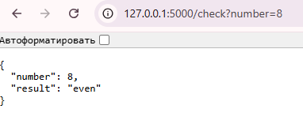

# Flask API для проверки чётности числа
Это простое веб-приложение на Python с использованием Flask, которое предоставляет API для проверки, является ли число чётным или нечётным.

## Установка
1. Убедитесь, что Python и pip установлены.
2. Установите Flask с помощью команды:
   ```bash
   pip install flask

## Запуск приложения
1. Запустите приложение командой:
python app.py
2. Приложение запустится на http://127.0.0.1:5000.


## Использование
GET-запрос
1. Отправьте GET-запрос на /check, передав число через параметр number. Пример:
http://127.0.0.1:5000/check?number=8

Ответ:
{"number": 8, "result": "even"}
