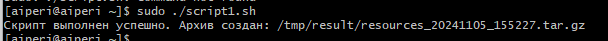
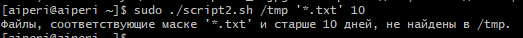
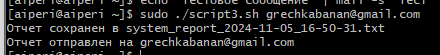

# Скрипты для управления системными ресурсами и отправки отчетов

## Описание
Этот репозиторий содержит скрипты на Bash для различных задач, включая сбор информации о системных ресурсах, удаление файлов по маске и времени, а также отправку отчетов по электронной почте.

## Скрипты

### 1. `script1.sh`
Скрипт собирает информацию о загрузке системных ресурсов и создает отчет в текстовом файле.

#### Функциональность:
- Сбор текущей загрузки ЦПУ
- Информация о занятой и свободной оперативной памяти
- Доступное место на диске
- Топ-5 процессов, потребляющих больше всего CPU и RAM
- Отчет включает дату и время выполнения скрипта
- Возможность отправки отчета на указанный e-mail

#### Результат работы:


### 2. `script2.sh`
Скрипт удаляет файлы из указанной директории, соответствующие заданной маске и старше указанного количества дней.

#### Функциональность:
- Удаление файлов по маске (например, `*.txt`, `photo_*.jpg`)
- Запрос подтверждения перед удалением файлов
- Поддержка опции `-y` для удаления без подтверждения

#### Результат работы:


### 3. `script3.sh`
Скрипт выполняет дополнительные задачи, связанные с управлением системными ресурсами или очисткой.

#### Результат работы:


## Установка
Убедитесь, что у вас установлены необходимые пакеты для отправки e-mail:
```bash
sudo yum install mailx postfix -y
