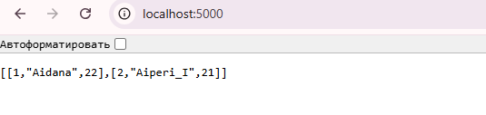

1. Создать и подробно описать Dockerfile для сборки приложения. Приложение должно получать информацию из БД. Dockerfile должен развернуть два контейнера - один с БД, другой с приложением. 
2. Показать в скриншотах (выложить на гитхаб), как работает ваш Dockerfile. Сам Dockerfile с описанием также должен быть выложен на гитхаб.

# Flask App with PostgreSQL in Docker

## Описание
Проект представляет собой простое Flask-приложение, которое подключается к PostgreSQL-базе данных для получения данных из таблицы `users`. Приложение и база данных разворачиваются в отдельных Docker-контейнерах с использованием `docker-compose`.

## Как запустить проект
1. Убедитесь, что у вас установлен Docker и Docker Compose.
2. Склонируйте репозиторий:
   ```bash
   git clone https://github.com/ririshka/DevOps-DBA.git
   cd DevOps-DBA/Docker_with_app&DB



