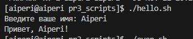
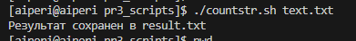
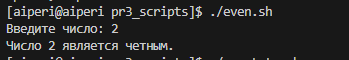
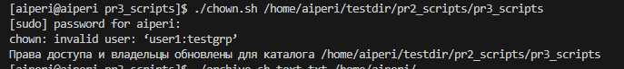
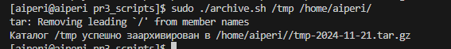

1) Напишите скрипт, который запрашивает имя пользователя и выводит приветственное сообщение с введенным именем.

2) Напишите скрипт, который принимает имя файла в качестве аргумента и выводит количество строк в файле, как результат, в новый файл.

3) Напишите скрипт, который проверяет, является ли введенное число четным или нечетным.

4) Напишите скрипт, который автоматизирует установку прав доступа и изменение владельца для всех файлов и каталогов внутри заданного каталога. При выполнении скрипта, у всех файлов в каталоге должны устанавливаться владелец user1 и группа testgrp. Также, все файлы должны получать права, при которых у владельца файла есть все права, у членов группы права на чтение и запись, у остальных - только на чтение.

5) Напишите скрипт, который создаёт архив заданного каталога, сохраняя его в указанное место и добавляя текущую дату к имени архива. Заархивируйте всю папку testdir.

